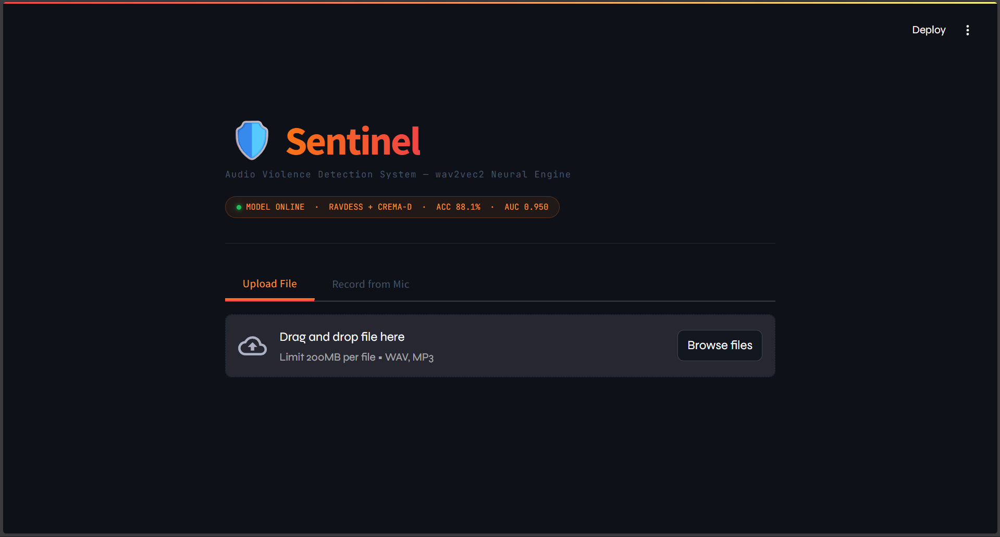

# 🛡️ Sentinel — Audio Violence Detection System

> Real-time audio violence detection powered by fine-tuned wav2vec2 — built for surveillance and safety applications.

---

## Overview

Sentinel is an end-to-end audio violence detection system that classifies audio as **violent** or **non-violent** in real time. It accepts uploaded audio files or live microphone recordings and runs them through a fine-tuned **wav2vec2** neural network with a multi-stage filtering pipeline.

The project was built with a research-grade methodology — proper actor-disjoint train/test splits, honest evaluation, and a documented progression from classical ML baselines to deep learning.

---

## Demo



---

## Results

| Method | Features | Split Type | Accuracy | AUC |
|---|---|---|---|---|
| Classical ML (SVM) | 41 handcrafted | Clip-level (leaky) | ~90% | ~0.98 |
| Classical ML (SVM) | 41 handcrafted | Actor-disjoint (honest) | 74.2% | 0.816 |
| Classical ML + Pitch (SVM) | 43 features | Actor-disjoint | 74.2% | 0.816 |
| **wav2vec2 fine-tuned** | Raw audio | **Actor-disjoint** | **88.1%** | **0.950** |

A key finding of this project is that clip-level train/test splits — common in published literature — inflate accuracy by ~16% due to data leakage. Actor-disjoint evaluation reveals the true generalisation performance.

---

## Architecture

```
Audio Input (WAV / MP3 / Mic)
        │
        ▼
 ┌─────────────────┐
 │  Preprocessing  │  High-pass filter → spectral denoising → normalise
 └────────┬────────┘
          │
          ▼
 ┌─────────────────┐
 │   Music Gate    │  Block calm quiet music (beat strength + RMS + ZCR check)
 └────────┬────────┘
          │
          ▼
 ┌─────────────────┐
 │   wav2vec2      │  facebook/wav2vec2-base fine-tuned on RAVDESS + CREMA-D
 └────────┬────────┘
          │
          ▼
 ┌─────────────────┐
 │ Threshold Gate  │  Confidence ≥ 0.65 AND sustained energy ≥ 20% of frames
 └────────┬────────┘
          │
          ▼
   VIOLENT / NON-VIOLENT
```

---

## Dataset

Trained on **RAVDESS** and **CREMA-D** — two professional, individually-labelled speech emotion datasets.

| Dataset | Clips | Speakers | Labels used |
|---|---|---|---|
| RAVDESS | 1,440 | 24 actors | Angry + Fearful → Violent, Neutral + Calm + Happy → Non-Violent |
| CREMA-D | 7,442 | 91 actors | ANG + FEA → Violent, NEU + HAP → Non-Violent |

**Why these datasets over the common VSD (Violence Sound Dataset):**
- Every clip is individually human-verified — no blind time-slicing
- Diverse speakers across age, gender, and ethnicity
- Both classes recorded under identical conditions — model learns emotion, not recording environment
- Actor-disjoint splits prevent data leakage

---

## Features

- 🎙️ **Live mic recording** with noise reduction and high-pass filtering
- 📁 **File upload** supporting WAV and MP3
- 🧠 **wav2vec2 neural engine** — 88.1% accuracy, AUC 0.950
- 🎵 **Smart music gate** — distinguishes calm music from violent audio with background music
- ⚡ **Energy gate** — requires sustained loudness to confirm violence, filters single loud words
- 📊 **Real-time waveform** visualisation
- 🔬 **System diagnostics** panel showing decision reason and model stats

---

## Installation

### Prerequisites
- Python 3.9+
- The `wav2vec2_model/` folder (download separately — see below)

### Setup

```bash
# Clone the repo
git clone https://github.com/YOUR_USERNAME/sentinel-violence-detector.git
cd sentinel-violence-detector

# Install dependencies
pip install -r requirements.txt

# Run the app
streamlit run app.py
```

### Model Setup

The wav2vec2 model is too large for GitHub (~380MB). Download it separately:

1. Download `wav2vec2_model.zip` from [Releases](https://github.com/YOUR_USERNAME/sentinel-violence-detector/releases)
2. Extract and place the `wav2vec2_model/` folder in the project root

Your folder structure should look like:
```
sentinel-violence-detector/
├── app.py
├── requirements.txt
├── README.md
├── wav2vec2_model/
│   ├── config.json
│   ├── model.safetensors
│   ├── preprocessor_config.json
│   ├── tokenizer_config.json
│   └── vocab.json
```

---

## Requirements

```
streamlit
torch
transformers
librosa
soundfile
numpy
scipy
plotly
sounddevice
```

Or install all at once:
```bash
pip install -r requirements.txt
```

---

## Training

The training notebook `violence_detection_v2.ipynb` is included. To retrain:

1. Get Kaggle API credentials from kaggle.com → Settings → API
2. Open the notebook in Google Colab
3. Run all cells — downloads RAVDESS and CREMA-D automatically via Kaggle API
4. Saves `wav2vec2_model/` to your Google Drive

---

## Project Structure

```
sentinel-violence-detector/
├── app.py                          # Streamlit application
├── violence_detection_v2.ipynb     # Training notebook (Colab)
├── requirements.txt
├── .gitignore
└── README.md
```

---

## Key Findings

**1. Evaluation protocol matters as much as model choice**
Clip-level splits (the standard in most papers) inflate accuracy by ~16% due to data leakage from the same speaker appearing in both train and test. Actor-disjoint evaluation is required for honest benchmarking.

**2. Classical ML hits a hard ceiling at ~74% regardless of feature engineering**
Adding pitch/F0 features to 41 handcrafted features produced zero improvement (74.2% → 74.2%), demonstrating the ceiling is architectural, not feature-related.

**3. wav2vec2 breaks the ceiling decisively**
Switching to learned representations from raw audio jumped accuracy from 74.2% → 88.1% (+14%) and AUC from 0.816 → 0.950.

**4. ADC quantization simulation**
The feature extraction pipeline simulates 10-bit ADC quantization to model real embedded hardware constraints — a novel preprocessing step not commonly seen in violence detection literature.

---

## Limitations

- Model trained on acted emotional speech — real-world violence may sound different
- Rap and hip-hop with aggressive delivery can occasionally trigger false positives (mitigated by threshold and energy gates)
- CPU inference takes 2–5 seconds per clip — GPU recommended for real-time deployment

---

## Future Work

- Add music as an explicit third class to eliminate music false positives at the model level
- Two-stage pipeline: music/speech classifier → violence classifier
- Fine-tune on real-world violence audio (UrbanSound8K, AudioSet)
- Sliding window real-time analysis for continuous surveillance streams

---

## License

MIT License — see `LICENSE` for details.

---

## Acknowledgements

- [RAVDESS Dataset](https://zenodo.org/record/1188976) — Livingstone & Russo, 2018
- [CREMA-D Dataset](https://github.com/CheyneyComputerScience/CREMA-D) — Cao et al., 2014
- [facebook/wav2vec2-base](https://huggingface.co/facebook/wav2vec2-base) — Baevski et al., 2020